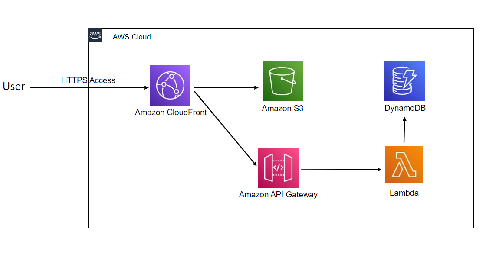

# 仕様書
## 使用する環境
AWS

## 構成図(概略)

## クライアント
### 使用するサービス
- Amazon S3
  - 静的サイトホスティング
- Amazon CloudFront
  - CDNによるアクセスの負荷分散、CNAMEの設定
- Amazon Route53
  - 独自ドメインの提供

### 実装
クライアント(Webアプリケーション)はAmazon S3上に配置され、CloudFrontにより配信される。

## サーバー
### 使用するサービス
- AWS Lambda
  - サーバーコードの実行基盤
- Amazon DynamoDB
  - 盤面情報格納
- Amazon API Gateway
  - REST APIの管理
- Amazon CloudFront
  - APIのレスポンスのキャッシュ

### 実装
サーバーアプリケーションはAWS Lambda上で実行する。

REST APIとしてのサーバーアプリケーションの公開にはAmazon API Gatewayを用い、CloudFrontによってドメイン割当・レスポンスのキャッシュをする。

永続層は、Amazon DynamoDBを使用する。

## ネットワーク
- AWS IAM
  - アクセス権限付与

### 実装
コンテナの実行ロール以外にAmazon DynamoDBに対するアクセス権を与えないようにAWS IAMのロールを設定する。
